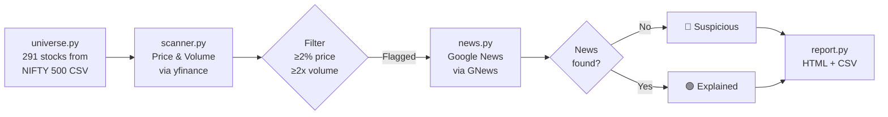

# Insider Activity Scanner — Walkthrough

## What Was Built

A Python-based scanner that detects suspicious stock moves in Indian mid/small-cap stocks (NIFTY 500, rank 210–500) by identifying **positive price moves with abnormal volume but no public news** — a signal of potential insider-driven trading.

## Architecture



## Project Files

| File | Purpose |
|------|---------|
| [main.py](file:///C:/Users/mania/.gemini/antigravity/scratch/insider-scanner/main.py) | Entry point & orchestrator with CLI args |
| [config.py](file:///C:/Users/mania/.gemini/antigravity/scratch/insider-scanner/config.py) | All tuneable parameters |
| [universe.py](file:///C:/Users/mania/.gemini/antigravity/scratch/insider-scanner/universe.py) | Stock universe from NIFTY 500 CSV |
| [scanner.py](file:///C:/Users/mania/.gemini/antigravity/scratch/insider-scanner/scanner.py) | Price/volume scanner via yfinance |
| [news.py](file:///C:/Users/mania/.gemini/antigravity/scratch/insider-scanner/news.py) | News verification via Google News |
| [report.py](file:///C:/Users/mania/.gemini/antigravity/scratch/insider-scanner/report.py) | HTML dashboard + CSV export |

## Test Results

### Module Tests
- **universe.py**: Loaded 291 stocks from real NIFTY 500 CSV (downloaded from NSE India)
- **scanner.py**: Fetched price/volume for 10/10 test stocks successfully
- **news.py**: Correctly found news for Reliance, Cochin Shipyard; correctly returned no-news for fake company

### Integration Test
Full pipeline ran successfully on 10 stocks with HTML + CSV report generated.

### HTML Report Preview


## Usage

```bash
# Run scan immediately (default: ≥2% price, ≥2x volume)
python main.py

# Custom thresholds
python main.py --min-pct 3 --min-vol-ratio 2.5

# Schedule daily at 2:30 PM IST
python main.py --schedule
```

> [!IMPORTANT]
> Set `PYTHONIOENCODING=utf-8` on Windows before running, or run via:
> `$env:PYTHONIOENCODING='utf-8'; python main.py`

## Configuration

All parameters in [config.py](file:///C:/Users/mania/.gemini/antigravity/scratch/insider-scanner/config.py):

| Parameter | Default | Description |
|-----------|---------|-------------|
| `MIN_PCT_CHANGE` | 2.0 | Minimum price % change to flag |
| `MAX_PCT_CHANGE` | 15.0 | Ignore very large moves (circuits) |
| `MIN_VOLUME_RATIO` | 2.0 | Current vol / 20-day avg vol |
| `RANK_START` | 210 | Start of market cap rank |
| `RANK_END` | 500 | End of market cap rank |
| `NEWS_LOOKBACK_HOURS` | 24 | News search window |
| `SCAN_TIME` | 14:30 | Scheduled scan time (IST) |

## Future Enhancements (v2)
- Sector-relative performance check (filter out sector-wide moves)
- Board meeting / results calendar check from BSE
- Telegram/email alerts
- Historical backtesting to validate signal hit rate
- Broker API integration (Zerodha Kite) for real-time data
